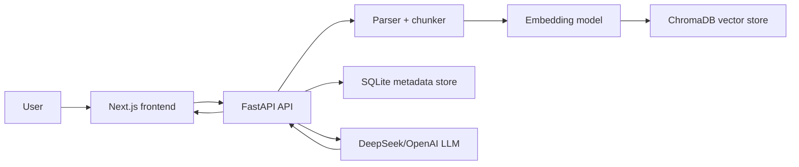

# AI Document Assistant

[](https://github.com/Fhonglei/ai-doc-assistant/actions/workflows/ci.yml)

A full-stack RAG document Q&A app for uploading PDF, DOCX, and TXT files, asking natural-language questions, and receiving streaming answers with source citations.

This project is a full-stack AI application with document ingestion, vector search, citation-aware generation, conversation history, optional login, user-level data isolation, Docker Compose, deployment configuration, backend tests, and a small RAG evaluation harness.

## Demo

- Frontend: https://frontend-fhongleis-projects.vercel.app
- Backend health check: https://mindful-determination-production-e41c.up.railway.app/api/health
- Demo script: `docs/DEMO_SCRIPT.md`
- Production checklist: `docs/PRODUCTION_CHECKLIST.md`

The deployed backend will report `degraded` until `DEEPSEEK_API_KEY` or `OPENAI_API_KEY` is configured.

## Highlights

- Multi-format upload for PDF, DOCX, and TXT.
- Asynchronous ingestion: upload returns immediately, then parsing, chunking, embedding, and indexing run in the background.
- RAG retrieval with ChromaDB and local sentence-transformer embeddings.
- Optional LLM reranking and citation-aware answer generation.
- Streaming chat over SSE with inline `[1]` citations and source chunk viewer.
- Conversation history with scoped document search.
- Optional email/password login and per-user document/conversation isolation.
- Document management: search, rename, delete, bulk delete, reindex, and inspect chunks.
- Docker Compose for one-command local startup.
- Render Blueprint and Vercel configuration for online deployment.
- Backend tests and a small RAG evaluation dataset.

## Tech Stack

| Layer | Technology |
| --- | --- |
| Frontend | Next.js 15, React, Tailwind CSS, Zustand |
| Backend | FastAPI, Pydantic, SQLite, ChromaDB |
| AI | DeepSeek/OpenAI-compatible chat API, sentence-transformers |
| Retrieval | Chunking, embeddings, vector search, LLM reranking |
| Deployment | Vercel frontend, Render/Railway backend, Docker Compose |
| Testing | pytest, FastAPI TestClient, mock LLM tests |

## Architecture



## Quick Start

### Option 1: Docker Compose

Create a `.env` file in the repository root:

```bash
DEEPSEEK_API_KEY=sk-your-key
CORS_ORIGINS=http://localhost:3000
AUTH_ENABLED=false
AUTH_SECRET_KEY=local-dev-secret-change-me
```

Run the stack:

```bash
docker compose up --build
```

Open:

- Frontend: `http://localhost:3000`
- Backend health: `http://localhost:8000/api/health`

### Option 2: Manual Local Setup

Backend:

```bash
cd backend
cp .env.example .env
pip install -r requirements.txt
python main.py
```

Frontend:

```bash
cd frontend
cp .env.local.example .env.local
npm install
npm run dev
```

## Environment Variables

### Backend

| Variable | Required | Description |
| --- | --- | --- |
| `DEEPSEEK_API_KEY` | Yes, unless using OpenAI | DeepSeek API key |
| `OPENAI_API_KEY` | Optional | Fallback OpenAI-compatible key |
| `DEEPSEEK_BASE_URL` | No | Default: `https://api.deepseek.com/v1` |
| `LLM_MODEL` | No | Default: `deepseek-chat` |
| `CHROMA_PERSIST_DIR` | No | Chroma persistent data path |
| `METADATA_DB_PATH` | No | SQLite metadata path |
| `UPLOAD_DIR` | No | Original uploaded files for reindexing |
| `CORS_ORIGINS` | Yes in deployment | Comma-separated allowed frontend URLs |
| `AUTH_ENABLED` | No | Set `true` to require login |
| `AUTH_SECRET_KEY` | Yes if auth enabled | Long random token signing secret |

### Frontend

| Variable | Required | Description |
| --- | --- | --- |
| `NEXT_PUBLIC_API_URL` | Yes | Public backend URL |

## Testing

Backend tests:

```bash
cd backend
pytest
```

Covered areas:

- File type validation.
- TXT parsing.
- Chunk generation.
- Chat API behavior with mocked retrieval and mocked LLM generation.

Frontend checks:

```bash
cd frontend
npm run lint
npm run typecheck
npm run build
```

## RAG Evaluation

Run a fast offline retrieval check:

```bash
cd backend
python scripts/evaluate_rag.py
```

Run a live backend evaluation:

```bash
python scripts/evaluate_rag.py --backend-url http://localhost:8000
```

If auth is enabled:

```bash
python scripts/evaluate_rag.py --backend-url https://your-api.onrender.com --token YOUR_ACCESS_TOKEN
```

The evaluation writes a JSON report to `backend/evals/last_run.json`.

## Deployment

### Backend on Render

This repository includes `render.yaml`.

1. Push the repository to GitHub.
2. Open Render Blueprint:
   `https://dashboard.render.com/blueprint/new?repo=https://github.com/Fhonglei/ai-doc-assistant`
3. Fill secret environment variables:
   - `DEEPSEEK_API_KEY`
   - `OPENAI_API_KEY` if needed
   - `CORS_ORIGINS`
   - `AUTH_SECRET_KEY`
4. Apply the Blueprint and wait for `/api/health` to return 200.

### Frontend on Vercel

Deploy the `frontend/` directory.

Required Vercel environment variable:

```bash
NEXT_PUBLIC_API_URL=https://your-render-service.onrender.com
```

After the backend URL is known, redeploy the frontend so the public API URL is baked into the Next.js build.

## Security Notes

- API keys only live in backend environment variables.
- CORS is explicit through `CORS_ORIGINS`.
- `AUTH_ENABLED=true` requires users to register/login.
- Documents, conversations, and vector search are scoped by user ID.
- Uploaded files are size and type checked before ingestion.
- Security headers are added by FastAPI middleware.
- Use a long random `AUTH_SECRET_KEY` in production.

## Project Structure

```text
ai-doc-assistant/
  backend/
    app/
      api/          FastAPI routes
      core/         parsing, chunking, retrieval, generation, auth
      db/           SQLite metadata store and ChromaDB vector store
      models/       Pydantic schemas
    evals/          sample RAG evaluation dataset
    scripts/        evaluation runner
    tests/          pytest test suite
  frontend/
    src/
      app/          Next.js App Router
      components/   UI components
      hooks/        React hooks
      lib/          typed API client and types
      stores/       Zustand state stores
  docker-compose.yml
  render.yaml
```
